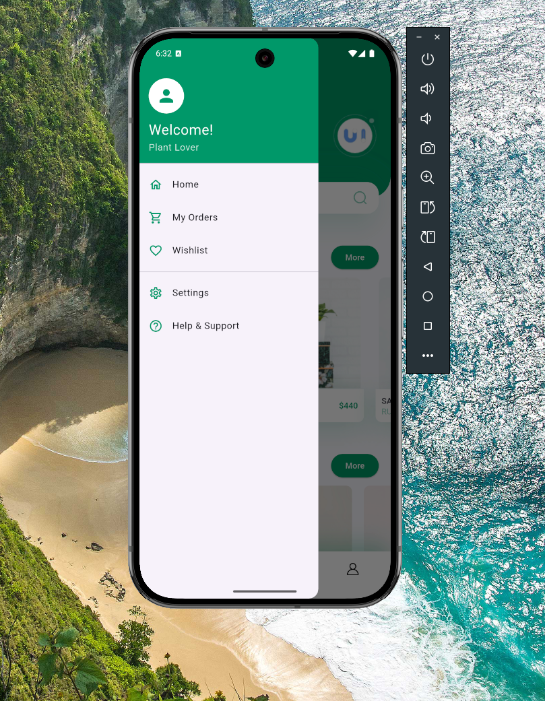
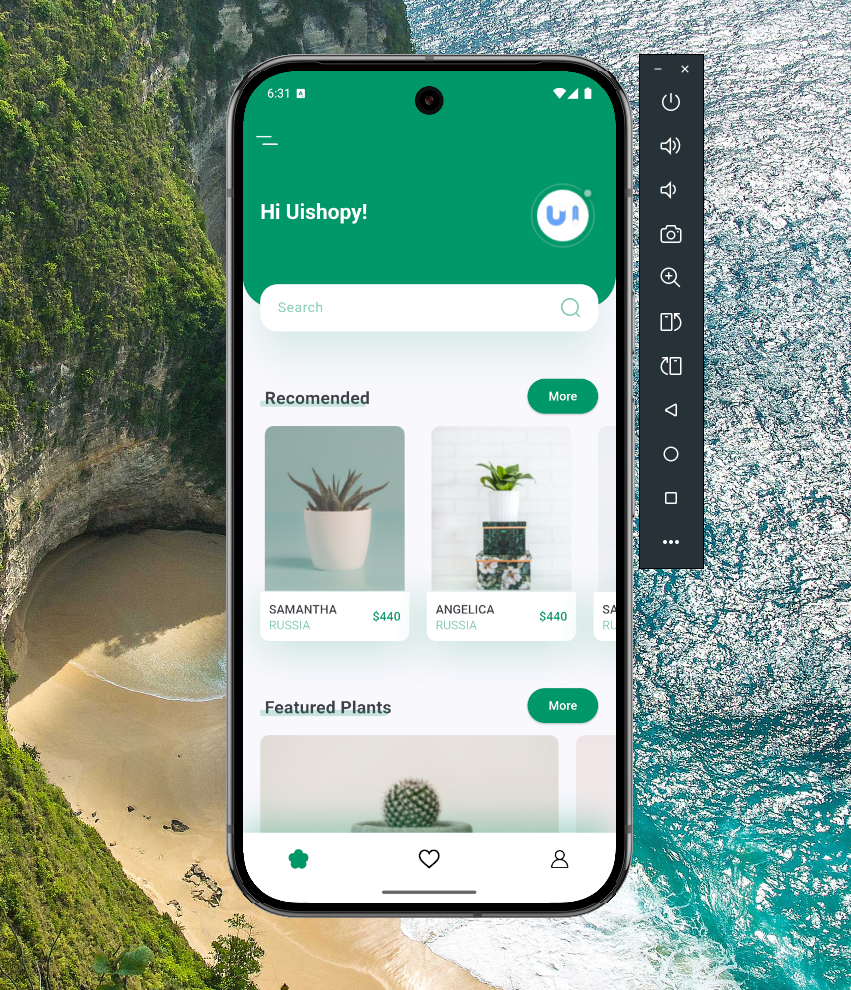
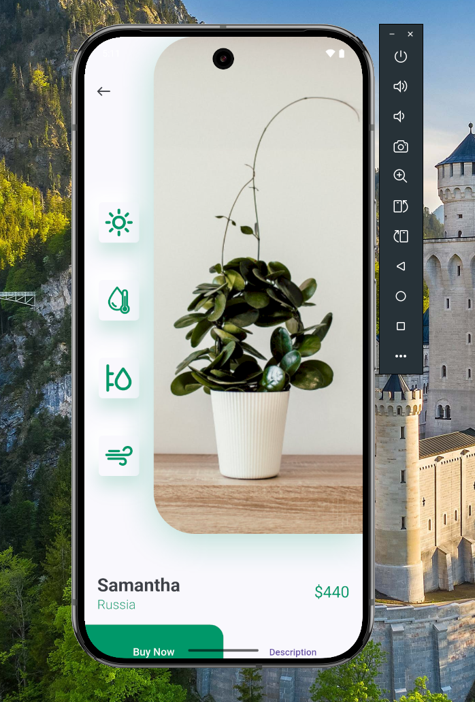

  <h1>🌿 Plant App</h1>
  
A beautiful Flutter application for plant enthusiasts to browse and purchase plants.

 

## 📱 App Preview

  <h3>Main App Demo</h3>
  

 

### 📸 Screenshots

  

    
    
    
  

 

## ✨ Features

<b>🏠 Home Screen</b>

 
  
- Beautiful header with search functionality
- Recommended plants section
- Featured plants with animations
- Clean and intuitive UI

<b>🔄 Navigation</b>

 
  
- Custom bottom navigation bar
- Smooth page transitions
- Side drawer with multiple options

<b>📋 Details Screen</b>

 
  
- Plant details with images
- Price and country information
- Buy now functionality
- Interactive icons

<b>📱 Other Screens</b>

 
  
- Favorites screen
- Profile screen
- Settings (coming soon)

 

## 📂 Project Structure

<b>📱 Components</b>

 

- `base_layout.dart` - Base scaffold for all screens
- `my_bottom_nav_bar.dart` - Custom navigation bar
- `my_drawer.dart` - App drawer with menu items

<b>🎯 Screens</b>

 

- `home/` 
  - Main dashboard screen
  - Featured plants listing
  - Search functionality
- `details/`
  - Plant detail view
  - Purchase options
- `favorites/`
  - Saved plants view
- `profile/`
  - User profile screen

<b>🛠️ Utils</b>

 

- `page_transition.dart` - Custom page animations

<b>📄 Core Files</b>

 

- `constants.dart` - App-wide constants and theme data
- `main.dart` - Application entry point

 

## 📺 Video Tutorial

  

 

## 📚 Resources

  

 

  Built with ❤️ by Your Name

